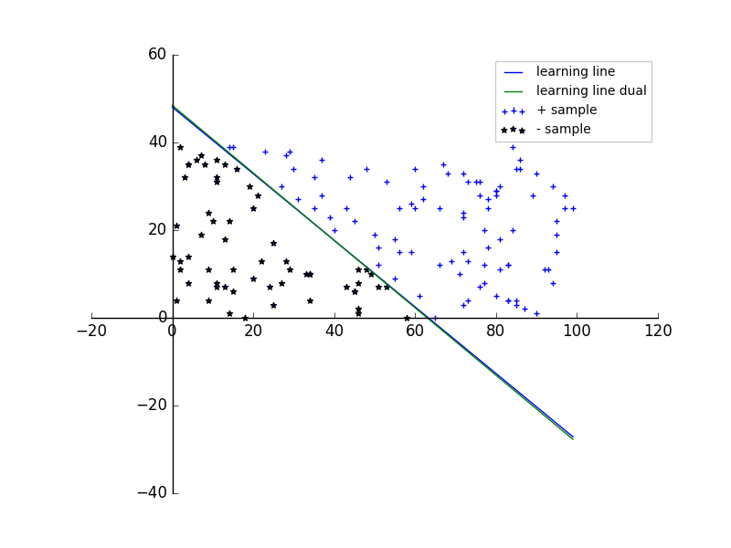
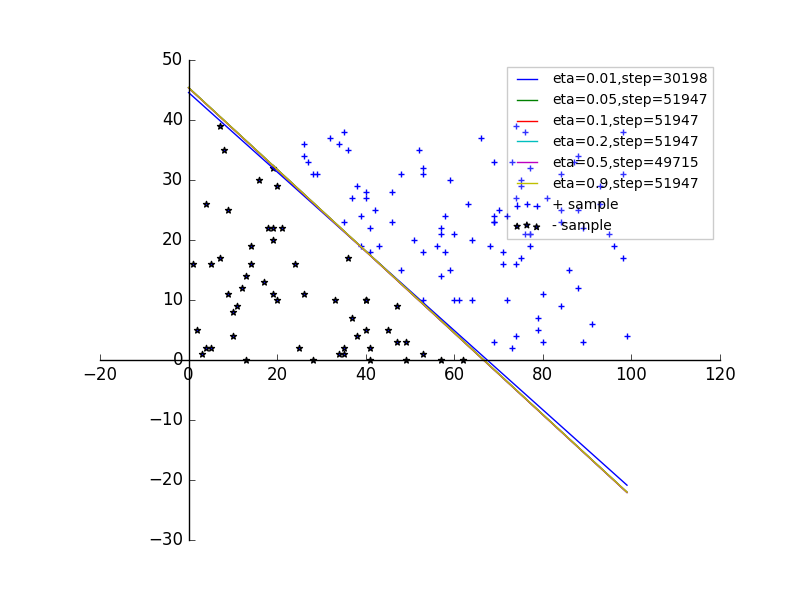
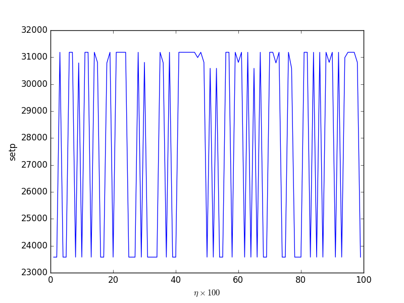
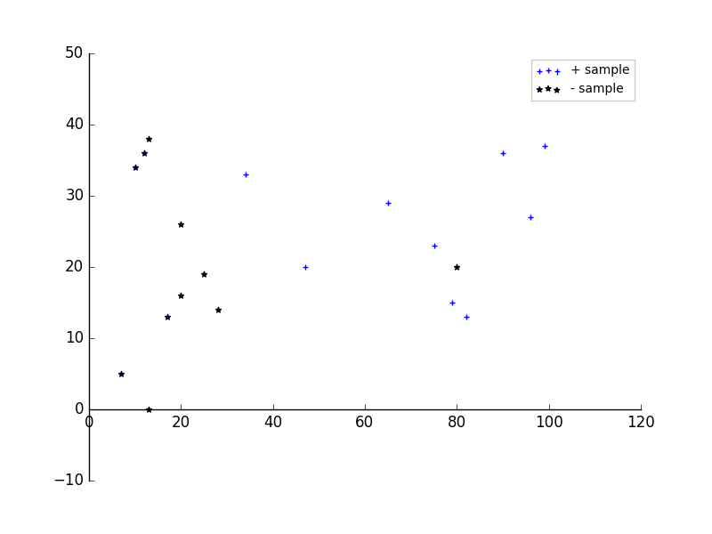

# 感知机

1.感知机是二类分类的线性分类模型。输入为实例的特征向量，输出为实例的类别（正类取值 +1, 负类取值 -1）。
> 感知机的物理意义：将输入控件（特征空间）划分为正负两类的分离超平面。
>
> 感知机模型是属于判别模型

2.**感知机的定义**：设输入空间（特征空间）为 \\(\mathscr X \subseteq \mathbb R^{n}\\)，输出空间为 \\( \mathscr Y =\\{+1,-1\\}\\)。输入 \\( \mathbf x \in \mathscr X\\)  为特征空间的点；输出 \\(y \in \mathscr Y\\) 为实例的类别。

定义函数： \\(f(x)=sign(\mathbf{w\cdot x}+b)\\) 为感知机。其中 \\(\mathbf w \in \mathbb R^{n}\\) 为权值向量，\\(b \in \mathbb R\\) 为偏置， \\(\cdot\\) 为向量内积。\\(\mathbf w,b\\) 为感知机的模型参数。
$$
sign(x)=\begin{cases}
+1, & x \ge 0 \\\
-1, & x \lt 0
\end{cases}
$$

- 感知机模型是线性分类模型，属于判别模型
- 感知机的假设空间为定义在特征空间中的所有线性分类器，即：\\(\mathscr F=\\{f \mid f(\mathbf x)=\mathbf{w\cdot x} +b , w\in \mathbb R^{n},b \in \mathbb R\\}\\)
- 感知机的几何解释： \\(\mathbf{w\cdot x}+b=0\\) 对应特征空间 \\(\mathbb R^{n}\\) 上的一个超平面 S 。
	- \\(\mathbf{w}\\)  是超平面 S 的法向量， b 是超平面的截距
	- 超平面 S 将特征空间划分为两个部分：
		- 超平面 S 上方的点判别为正类
		- 超平面 S 下方的点判别为负类
		> 超平面 S 也称作分离超平面

3.**数据集的线性可分**: 给定数据集 \\(T=\\{(\mathbf x_1,y_1),(\mathbf x_2,y_2),\cdots,\mathbf x_N,y_N)\\},\mathbf x_i \in \mathscr X \subseteq \mathbb R^{n},y_i \in \mathscr Y=\\{+1,-1\\},i=1,2,\cdots,N\\). 若存在某个超平面 S： \\(\mathbf{w\cdot x}+b=0\\)  使得将数据集中的正实例点与负实例点完全正确地划分到超平面的两侧，则称数据集 T 为线性可分数据集；否则称数据集 T 线性不可分。
> 划分到超平面两侧，用数学语言描述为：  \\((\mathbf{w\cdot x}+b)y_i \gt 0\\)  

4.感知机的损失函数为：误分类点到超平面 S 的总距离。
> 若定义成误分类点的中总数，则它不是  \\(\mathbf w,b\\) 的连续可导函数，不容易优化

- 对正确分类的点\\((\mathbf x_i,y_i)\\)，有 \\((\mathbf{w\cdot x}+b)y_i \gt 0\\)  
- 对误分类的点\\((\mathbf x_i,y_i)\\)，有 \\((\mathbf{w\cdot x}+b)y_i \lt 0\\) 

误分类的点\\((\mathbf x_i,y_i)\\)，则 \\(\mathbf x_i\\) 距离超平面的距离为： \\(\frac{1}{||\mathbf w||}|\mathbf{ w\cdot x}+b|\\)   ，其中 \\(||\mathbf w||\\) 为 \\(\mathbf w\\) 的 \\(L_2\\) 范数。

由于 \\(|y_i|=1\\)，因此上式等于 \\(\frac{- y_i(\mathbf{ w\cdot x}+b)}{||\mathbf w||}\\) 

不考虑 \\(\frac{1}{||\mathbf w||}\\)(因为感知机要求训练集线性可分，最终误分类点数量为零，此时损失函数为零。即使考虑分母，也是零。若训练集线性不可分，则感知机算法无法收敛。), 则得到感知机学习的损失函数：给定训练集 \\(T=\\{(\mathbf x_1,y_1),(\mathbf x_2,y_2),\cdots,\mathbf x_N,y_N)\\},\mathbf x_i \in \mathscr X \subseteq \mathbb R^{n},y_i \in \mathscr Y=\\{+1,-1\\},i=1,2,\cdots,N\\).  感知机 \\(sign(\mathbf{w\cdot x}+b)\\)  学习的损失函数定义为：
$$
L(\mathbf w,b)=-\sum_{\mathbf x_i \in M}y_i(\mathbf{w\cdot x_i}+b)
$$
其中 M  为误分类点的集合。它隐式的与 \\(\mathbf w, b\\) 相关，因为 \\(\mathbf w, b\\) 优化导致误分类点减少从而使得 M 收缩。

L 也是感知机学习的经验风险函数。

- 如果没有误分类点，则损失函数值为0，因为 \\(M=\phi\\)
- 误分类点越少或者误分类点距离超平面 S 越近， 则损失函数 L 越小
- 对于特定的样本点，其损失为：
	- 若正确分类，则损失为0
	- 若误分类，则损失为 \\(\mathbf w, b\\) 的线性函数

	因此给定训练集 T ，损失函数 \\(L(\mathbf w, b)\\) 是 \\(\mathbf w, b\\) 的连续可导函数。

5.**感知机学习算法**的原始形式：

- **算法描述**:给定训练集 \\(T=\\{(\mathbf x_1,y_1),(\mathbf x_2,y_2),\cdots,\mathbf x_N,y_N)\\},\mathbf x_i \in \mathscr X \subseteq \mathbb R^{n},y_i \in \mathscr Y=\\{+1,-1\\},i=1,2,\cdots,N\\)，求参数  \\(\mathbf w, b\\) ，使得 
$$
\min\_{\mathbf w,b} L(\mathbf w,b)=\min\_{\mathbf w,b}[-\sum_{\mathbf x_i \in M}y_i(\mathbf{w\cdot x_i}+b)]
$$
- 假设误分类点集合 M 是固定的，则损失函数 \\(L(\mathbf w,b)\\) 的梯度由：
$$
\nabla_\mathbf w L(\mathbf w,b)=- \sum\_{\mathbf x_i \in M}y_i \mathbf x_i \\\
\nabla\_b L(\mathbf w,b)=-\sum\_{\mathbf x_i \in M}y_i
$$
>其实梯度就是对应的偏导数

- **梯度下降法**:随机选取一个误分类点 \\((\mathbf x_i,y_i)\\)，对 \\(\mathbf w, b\\) 进行更新：
$$
\mathbf w \leftarrow \mathbf w+\eta y_i\mathbf x_i \\\
b \leftarrow b+\eta y_i
$$
其中 \\(\eta \in (0,1]\\)  是步长，即学习率。通过迭代可以使得损失函数  \\(L(\mathbf w,b)\\) 不断减小直到 0
> 每次修正一轮梯度，这就是梯度下降法的名字由来

- 感知机学习算法的原始形式：
	- 输入：线性可分训练集 \\(T=\\{(\mathbf x_1,y_1),(\mathbf x_2,y_2),\cdots,\mathbf x_N,y_N)\\},\mathbf x_i \in \mathscr X \subseteq \mathbb R^{n},y_i \in \mathscr Y=\\{+1,-1\\},i=1,2,\cdots,N\\)，学习率 \\(\eta \in (0,1]\\)  
	- 输出： \\(\mathbf w, b\\)  ； 感知机模型： \\(f(x)=sign(\mathbf {w\cdot x}+ b)\\) 
	- 步骤：
		- 选取初始值 \\(\mathbf w_0, b_0\\)
		- 在训练集中选取数据  \\((\mathbf x_i,y_i)\\)
		- 若 \\(y_i(\mathbf {w\cdot x_i}+ b) \le 0\\)  则：
		$$
		\mathbf w \leftarrow \mathbf w+\eta y_i\mathbf x_i \\\
		b \leftarrow b+\eta y_i
		$$
		- 在训练集中重复选取数据来更新 \\(\mathbf w, b\\)  直到训练集中没有误分类点
> 对于某个点 \\((\mathbf x_i,y_i)\\) 若选取它时，发现它是一个误分类点。则进行梯度下降后，设该点距离新的超平面 S'为 d' ；而梯度下降之前，设该点距离旧的超平面 S 为 d。则：
$$
\Delta d=d'-d=\frac{1}{||\mathbf w'||}|\mathbf{ w'\cdot x_i}+b'|-\frac{1}{||\mathbf w||}|\mathbf{ w\cdot x_i}+b|
\\\
=-\frac{1}{||\mathbf w'||}y_i(\mathbf{ w'\cdot x_i}+b')+\frac{1}{||\mathbf w||}y_i(\mathbf{ w\cdot x_i}+b)\\\
\simeq -\frac{y_i}{||\mathbf w||}[\mathbf{(w'-w)\cdot x_i} +(b'-b)]\\\
=-\frac{y_i}{||\mathbf w||}[\mathbf{\eta y_i x_i\cdot x_i} +\eta y_i]\\\
=-\frac{y_i^{2}}{||\mathbf w||}(\eta \mathbf{x_i\cdot x_i} +1) \lt 0
$$
> 因此有 \\(d' \lt d\\)，这里要求 \\(\mathbf {w' \simeq w}\\)，因此步长 \\(\eta\\) 要相当小

- **几何解释**：当一个实例点被误分类时，调整  \\(\mathbf w, b\\)  使得分离平面向该误分类点的一侧移动，以减少该误分类点与超平面间的距离，直至超平面越过所有的误分类点以正确分类。
			
6.感知机学习算法由于采用不同的初值或者误分类点选取顺序的不同，最终解可以不同

7.感知机收敛性定理：设训练集 \\(T=\\{(\mathbf x_1,y_1),(\mathbf x_2,y_2),\cdots,\mathbf x_N,y_N)\\},\mathbf x_i \in \mathscr X \subseteq \mathbb R^{n},y_i \in \mathscr Y=\\{+1,-1\\},i=1,2,\cdots,N\\)，其中 T 是线性可分的。

- 存在满足 \\(||\mathbf{\hat w}_{opt}||=1\\) 的超平面 \\(\mathbf{\hat w}\_{opt} \cdot \mathbf{\hat x}=\mathbf w\_{opt} \cdot \mathbf x + b\_{opt}=0\\) 将 T 完全正确分开。且存在 \\(r\gt 0\\) ，对所有的 i=1,2,...N 有\\(y_i(\mathbf{\hat w}\_{opt} \cdot \mathbf{\hat x})=y_i(\mathbf w\_{opt} \cdot \mathbf x + b\_{opt}) \ge r\\), 其中 \\(\mathbf{\hat w}=(\mathbf w,b),\mathbf{\hat x}=(\mathbf x,1),\mathbf{\hat w} \in \mathbb R^{n+1}, \mathbf{\hat x} \in \mathbb R^{n+1},\mathbf{w} \in \mathbb R^{n}, \mathbf{x} \in \mathbb R^{n}\\)
- 令 \\(R=\max_{1 \le i \le N}||\mathbf{\hat x_i}||\\), 则感知机学习算法原始形式在 T 上的误分类次数 k 满足： \\( k \le (\frac {R}{r})^{2}\\)
> - 该定理说明了当训练集线性可分时，感知机学习算法原始形式迭代时收敛的
> - 但是算法存在许多解，既依赖于初值，又依赖于误分类点的选择顺序。为了得出唯一超平面，需要对分离超平面增加约束条件
> - 当训练集线性不可分时，感知机学习算法不收敛。迭代结果会发生震荡

8.**感知机学习算法的对偶形式**：从原始形式 
\\(\mathbf w \leftarrow \mathbf w+\eta y_i\mathbf x_i ,\quad b \leftarrow b+\eta y_i\\)，取初始值  \\(\mathbf w_0, b_0\\)  均为0.则  \\(\mathbf w, b\\)  可以改写为：
$$
\mathbf w=\sum_{i=1}^{N} \alpha_i y_i \mathbf x_i\\\
b=\sum\_{i=1}^{N} \alpha_i y_i
$$

- 输入：线性可分数据集  \\(T=\\{(\mathbf x_1,y_1),(\mathbf x_2,y_2),\cdots,\mathbf x_N,y_N)\\},\mathbf x_i \in \mathscr X \subseteq \mathbb R^{n},y_i \in \mathscr Y=\\{+1,-1\\},i=1,2,\cdots,N\\)，学习率 \\(\eta \in (0,1]\\)  
- 输出： \\(\alpha,b\\),感知机模型 \\(f(x)=sign(\sum_{j=1}^{N} \alpha_j y_j \mathbf{x_j \cdot x}+b)\\)；其中 \\(\alpha=(\alpha_1,\alpha_2,\cdots,\alpha_N)\\)
- 步骤：
	- \\(\alpha \leftarrow \mathbf 0,b \leftarrow 0\\)
	- 在训练集中选取数据 \\((\mathbf x_i,y_i)\\)
	- 若 \\(y_i(\sum_{j=1}^{N} \alpha_j y_j \mathbf{x_j \cdot x}+b) \le 0\\)  则：
	$$
	\alpha_i \leftarrow \alpha_i+\eta\\\
	b \leftarrow b+\eta y_i
	$$
	- 在训练集中重复选取数据来更新 \\(\alpha, b\\)  直到训练集中没有误分类点
> 在对偶形式中， 训练集 T 仅仅以内积的形式出现（因为算法只需要内积信息）。可以预先将 T 中的实例间的内积计算出来并以矩阵形式存储，即 `Gram`矩阵： \\(G=[\mathbf{x_i \cdot x_j}]_{N \times N}\\)

9.与原始形式一样，感知机学习算法的对偶形式也是收敛的，且存在多个解。

10.下面代码给出了感知机学习算法以及对偶算法：

```
import numpy as np
import matplotlib.pyplot as plt
def training_data(num):
    '''
    生成随机的训练数据。X 为二维，其中第一维特征为 [0,100] 之间的随机整数；第二维特征为 [0,40] 之间的随机整数。
    :param num: 训练数据集大小
    :return: 训练数据集（一个 num*3 大小的数组，每一行为一个样本，最后一列为分类（1为正类，-1为负类））。划分直线为 4*x_1+5*x_2=250
    '''
    x_1=np.random.randint(low=0,high=100,size=(num,1))
    x_2=np.random.randint(low=0,high=40,size=(num,1))
    y= np.ones(shape=(num,1))
    y[4*x_1+5*x_2<250]=-1
    data_s=np.hstack((x_1,x_2,y))
    return data_s

def perceptron(t_data,eta,w_0,b_0):
     '''
     感知机的学习算法原始形式。
     :param t_data: 训练数据集。（一个 num*3 大小的数组，每一行为一个样本，最后一列为分类（1为正类，-1为负类））
     :param eta: 学习率，(0,1] 之间的数字
     :param w_0: 初始 w，一个二元行向量
     :param b_0: 初始 b，标量
     :return: 算法结束时的 (w,b,step_num)
     '''
     x=t_data[:,:-1]  # x 数据
     y=t_data[:,-1]  #  对应的分类
     total_row= t_data.shape[0] #样本集大小
     w=w_0
     b=b_0
     step_num=0
     while True:
        i=0
        while(i< total_row):
            step_num+=1
            x_i=x[i]
            y_i=y[i]
            if y_i*(np.dot(w,x_i)+b) <=0: # 该点是误分类点
                w=w+eta*y_i*x_i  # 梯度下降
                b=b+eta*y_i  # 梯度下降
                break # 梯度下降了，从头开始，执行下一轮筛选
            i=i+1 #该点不是误分类点，选取下一个样本点
        if(i== t_data.shape[0] ): #没有误分类点，结束循环
            break
     return (w,b,step_num)

def create_w(t_data,alpha):
    '''
    根据训练样本集和 alpha 获取 w
    :param t_data:训练数据集。（一个 num*3 大小的数组，每一行为一个样本，最后一列为分类（1为正类，-1为负类））
    :param alpha:alpha ，一个N元行向量，N 为训练集大小
    :return: w
    '''
    x=t_data[:,:-1]  # x 数据
    y=t_data[:,-1]  #  对应的分类
    N= t_data.shape[0] #样本集大小
    w=np.zeros_like(x[0])
    for i in range(0,N):
        w=w+alpha[0][i]*y[i]*x[i]
    return w
def perceptron_dual(t_data,eta,alpha_0,b_0):
    '''
    感知机算法的对偶形式
    :param t_data:训练数据集。（一个 num*3 大小的数组，每一行为一个样本，最后一列为分类（1为正类，-1为负类））
    :param eta:学习率，(0,1] 之间的数字
    :param alpha_0: 初始 alpha ，一个N元行向量，N 为训练集大小
    :param b_0:初始 b，标量
    :return:算法结束时的 (alpha,b,step_num)
    '''
    x=t_data[:,:-1]  # x 数据
    y=t_data[:,-1]  #  对应的分类
    total_row= t_data.shape[0] #样本集大小
    alpha=alpha_0
    b=b_0
    step_num=0
    while True:
        i=0
        while(i< total_row):
            step_num+=1
            x_i=x[i]
            y_i=y[i]
            if y_i*(np.dot(create_w(t_data,alpha),x_i)+b) <=0: # 该点是误分类点
                alpha[0][i]+=eta  # 梯度下降
                b+=eta*y_i  # 梯度下降
                break # 梯度下降了，从头开始，执行下一轮筛选
            i=i+1 #该点不是误分类点，选取下一个样本点
        if(i== t_data.shape[0] ): #没有误分类点，结束循环
            break
    return (alpha,b,step_num)

######  生成数据   #############
data_num=150 # 数据点个数
data=training_data(data_num)
w,b,step_num=perceptron(data,eta=0.1,w_0=np.zeros(shape=(1,2)),b_0=0)  # 感知机算法
alpha,b_alpha,step_num2=perceptron_dual(data,eta=0.1,alpha_0=np.zeros(shape=(1,data_num)),b_0=0)  # 感知机的对偶形式


###################  绘图   ##################
figure=plt.figure()
ax=figure.add_subplot(111)
########## 绘制样本集的散点图 ############
ax.scatter(data[:,0] [data[:,2]==1],data[:,1] [data[:,2]==1],label=r'+ sample',marker='+')
ax.scatter(data[:,0] [data[:,2]==-1],data[:,1] [data[:,2]==-1],label=r'- sample',marker='*')
########## 绘制学习到的分类超平面
line_x=np.arange(0,100)
line_y=-b/w[0][1]-line_x*w[0][0]/w[0][1]
w_alpha=create_w(data,alpha)
line_y_alpha=-b_alpha/w_alpha[1]-line_x*w_alpha[0]/w_alpha[1]
ax.plot(line_x,line_y,label=r'learning line')
ax.plot(line_x,line_y_alpha,label=r'learning line dual')
################## 设置  ############
#### 平移坐标轴
ax.spines['left'].set_position(('data',0))
ax.spines['right'].set_color('none')
ax.xaxis.set_ticks_position('bottom')
ax.spines['bottom'].set_position(('data',0))
ax.spines['top'].set_color('none')
ax.yaxis.set_ticks_position('left')

ax.legend(loc='upper right',fontsize=10,framealpha=0.2)
figure.savefig("F:/perception.png")
```
  

可以看到，两条学习直线相互重合。其中数据解释如下：

- 150个数据来自于随机生成，根据划分直线： \\(4\times x\_1+5 \times x\_2=250\\) 将样本点划分为正（大于250） 的点和负（小于等于250）的点。样本点为：

```
 [ 73.  31.   1.] [ 62.  27.   1.] [ 97.  28.   1.] [ 78.  16.   1.] [  9.  24.  -1.] [ 92.  11.   1.]
 [ 72.  15.   1.] [ 75.  31.   1.] [ 61.   5.   1.] [ 11.  31.  -1.] [ 39.  23.   1.] [ 85.  34.   1.] 
 [ 50.  19.   1.] [ 84.  20.   1.] [ 77.  12.   1.] [ 25.   3.  -1.] [ 56.  25.   1.] [ 33.  10.  -1.]
 [ 34.  10.  -1.] [ 21.  28.  -1.] [  4.  35.  -1.] [ 51.  12.   1.] [ 14.   1.  -1.] [  9.  11.  -1.]
 [ 55.  18.   1.] [ 43.   7.  -1.] [ 37.  28.   1.] [ 77.   8.   1.] [ 78.  25.   1.] [ 67.  35.   1.]
 [ 66.  12.   1.] [ 43.  25.   1.] [ 62.  30.   1.] [ 76.   7.   1.] [ 81.  11.   1.] [ 13.  18.  -1.]
 [  8.  35.  -1.] [ 97.  25.   1.] [ 46.   1.  -1.] [ 51.  16.   1.] [ 22.  13.  -1.] [  2.  11.  -1.]
 [ 10.  22.  -1.] [ 72.  33.   1.] [ 58.   0.  -1.] [ 72.  24.   1.] [ 31.  27.   1.] [ 59.  26.   1.]
 [ 49.  10.  -1.] [ 72.  23.   1.] [ 23.  38.   1.] [ 46.  11.  -1.] [ 94.  30.   1.] [ 95.  22.   1.]
 [ 80.  29.   1.] [  2.  13.  -1.] [ 48.  34.   1.] [ 35.  25.   1.] [ 83.   4.   1.] [  1.  21.  -1.]
 [ 76.  28.   1.] [ 15.  11.  -1.] [ 99.  25.   1.] [ 30.  34.   1.] [ 13.   7.  -1.] [ 85.   3.   1.]
 [ 94.   8.   1.] [ 15.  39.   1.] [ 11.  32.  -1.] [ 27.   8.  -1.] [ 76.  31.   1.] [ 60.  34.   1.]
 [ 45.   6.  -1.] [ 72.   3.   1.] [ 25.  17.  -1.] [ 27.  30.   1.] [ 66.  25.   1.] [ 29.  11.  -1.]
 [ 56.  15.   1.] [ 85.   4.   1.] [ 28.  13.  -1.] [ 73.  13.   1.] [ 80.   5.   1.] [ 13.  35.  -1.]
 [ 15.   6.  -1.] [ 35.  32.   1.] [ 48.  11.  -1.] [  2.  39.  -1.] [  1.   4.  -1.] [ 80.  28.   1.]
 [ 28.  37.   1.] [  4.  14.  -1.] [ 93.  11.   1.] [ 45.   6.  -1.] [ 83.   4.   1.] [ 71.  10.   1.]
 [ 59.  15.   1.] [ 45.  22.   1.] [ 11.   7.  -1.] [ 34.  10.  -1.] [ 24.   7.  -1.] [ 53.   7.  -1.]
 [ 53.  31.   1.] [ 19.  30.  -1.] [  0.  14.  -1.] [ 37.  36.   1.] [ 83.  12.   1.] [  9.   4.  -1.]
 [ 77.  20.   1.] [ 11.  36.  -1.] [ 95.  19.   1.] [ 20.  25.  -1.] [ 29.  38.   1.] [ 46.   8.  -1.]
 [ 87.   2.   1.] [ 20.   9.  -1.] [  7.  37.  -1.] [ 69.  13.   1.] [ 81.  18.   1.] [ 40.  20.   1.]
 [  4.   8.  -1.] [ 90.  33.   1.] [ 95.  15.   1.] [ 46.   2.  -1.] [ 51.   7.  -1.] [ 78.  27.   1.] 
 [  3.  32.  -1.] [ 68.  33.   1.] [ 89.  28.   1.] [ 16.  34.  -1.] [ 14.  22.  -1.] [  7.  19.  -1.]
 [  4.  35.  -1.] [ 86.  34.   1.] [  6.  36.  -1.] [ 65.   0.   1.] [ 60.  25.   1.] [ 44.  32.   1.]
 [ 73.   4.   1.] [ 18.   0.  -1.] [ 86.  36.   1.] [ 81.  30.   1.] [ 11.   8.  -1.] [ 80.  29.   1.]
 [ 14.  39.   1.] [ 55.   9.   1.] [ 34.   4.  -1.] [ 84.  39.   1.] [ 90.   1.   1.] [ 83.  12.   1.]]
```
- 感知机原始算法学习得到的曲线为：\\(6\times x\_1+7.9 \times x\_2=379.7\\) ;  
  感知机对偶算法学得的数据为：

	```
alpha=[  
    1.52900000e+02   3.80000000e+01   0.00000000e+00   2.30000000e+00    4.76000000e+01   0.00000000e+00  
    7.10000000e+00   0.00000000e+00    1.72000000e+01   1.43700000e+02   1.11100000e+02   0.00000000e+00
    0.00000000e+00   0.00000000e+00   0.00000000e+00   1.99400000e+02    0.00000000e+00   1.85500000e+02  
    4.20000000e+00   1.00000000e-01    0.00000000e+00   1.80000000e+00   0.00000000e+00   0.00000000e+00
    0.00000000e+00   6.61000000e+01   0.00000000e+00   0.00000000e+00    0.00000000e+00   0.00000000e+00  
    0.00000000e+00   0.00000000e+00    0.00000000e+00   0.00000000e+00   0.00000000e+00   0.00000000e+00
    0.00000000e+00   0.00000000e+00   0.00000000e+00   0.00000000e+00    0.00000000e+00   0.00000000e+00  
    0.00000000e+00   0.00000000e+00    5.99000000e+01   0.00000000e+00   4.00000000e-01   0.00000000e+00
    2.90000000e+00   0.00000000e+00   0.00000000e+00   0.00000000e+00    0.00000000e+00   0.00000000e+00  
    0.00000000e+00   0.00000000e+00    0.00000000e+00   0.00000000e+00   0.00000000e+00   0.00000000e+00
    0.00000000e+00   0.00000000e+00   0.00000000e+00   0.00000000e+00    0.00000000e+00   0.00000000e+00  
    0.00000000e+00   3.00000000e-01   0.00000000e+00   0.00000000e+00   0.00000000e+00   0.00000000e+00
    0.00000000e+00   0.00000000e+00   0.00000000e+00   0.00000000e+00    0.00000000e+00   0.00000000e+00  
    0.00000000e+00   0.00000000e+00    0.00000000e+00   0.00000000e+00   0.00000000e+00   0.00000000e+00
    0.00000000e+00   0.00000000e+00   0.00000000e+00   0.00000000e+00    0.00000000e+00   0.00000000e+00  
    0.00000000e+00   0.00000000e+00    0.00000000e+00   0.00000000e+00   0.00000000e+00   0.00000000e+00
    0.00000000e+00   0.00000000e+00   0.00000000e+00   0.00000000e+00    0.00000000e+00   0.00000000e+00  
    0.00000000e+00   0.00000000e+00    0.00000000e+00   0.00000000e+00   0.00000000e+00   0.00000000e+00
    0.00000000e+00   0.00000000e+00   0.00000000e+00   0.00000000e+00    0.00000000e+00   0.00000000e+00
    0.00000000e+00   0.00000000e+00    0.00000000e+00   0.00000000e+00   0.00000000e+00   0.00000000e+00
    0.00000000e+00   0.00000000e+00   0.00000000e+00   0.00000000e+00    0.00000000e+00   0.00000000e+00  
    0.00000000e+00   0.00000000e+00    0.00000000e+00   0.00000000e+00   0.00000000e+00   0.00000000e+00
    0.00000000e+00   0.00000000e+00   0.00000000e+00   4.00000000e-01    0.00000000e+00   0.00000000e+00  
    0.00000000e+00   0.00000000e+00    0.00000000e+00   0.00000000e+00   0.00000000e+00   0.00000000e+00   
    0.00000000e+00   0.00000000e+00   0.00000000e+00   0.00000000e+00    0.00000000e+00   0.00000000e+00
]
b= -377.9
	```
 
	其中的\\(\alpha_i\\) 最大的几个点：\\(\alpha_1=152.9,\alpha\_{10}=143.7,\alpha\_{11}=111.1,\alpha\_{16}=199.4,\alpha\_{18}=185.5\\)，对应的点为

	```
 [ 73.  31.   1.]  [ 11.  31.  -1.] [ 39.  23.   1.] [ 25.   3.  -1.][ 33.  10.  -1.]
	```

	它们就是距离划分平面最近的几个正类和负类。而大量的样本点的 \\(\alpha_i\\) 为0，表明它们对分类不起作用。
	
- 当 \\(\eta=0.1\\) ，样本点数量为150，初始值都为0时，计算量：
	- 原始形式：迭代 146938 次
	- 对偶形式：迭代 146553 次 
	
	可以看到二者几乎没多少差别
- 原始形式和对偶形式获得的划分超平面几乎重合

11.步长的影响（图中的 step 指的是迭代次数）：

  


下图是步长从  0.01~0.99  的感知机的迭代次数。（每次生成图形时的样本点都是随机产生的，因此与上图在 \\(\eta=0.01\\) 等位置时， 迭代次数有差别）

  

12.线性可分与不可分的影响，当生成了线性不可分的样本集时，感知机算法不收敛（20个点，源代码中的条件是：超过20万次迭代退出） 

  


