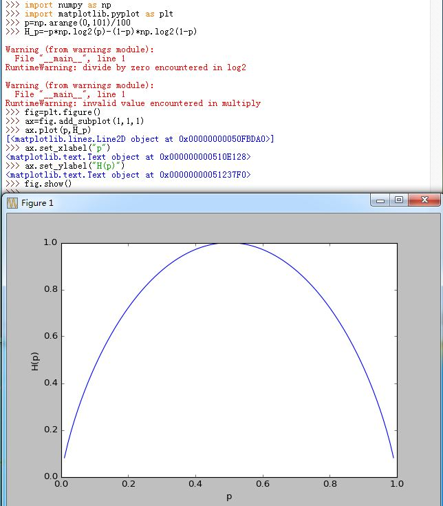
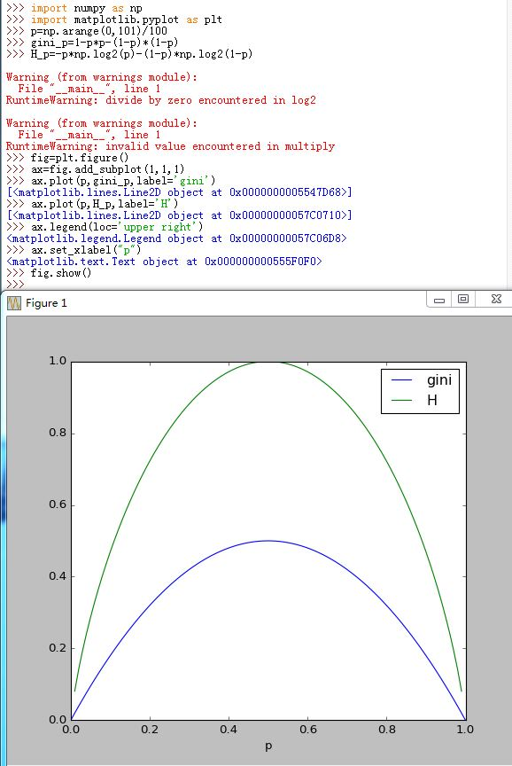
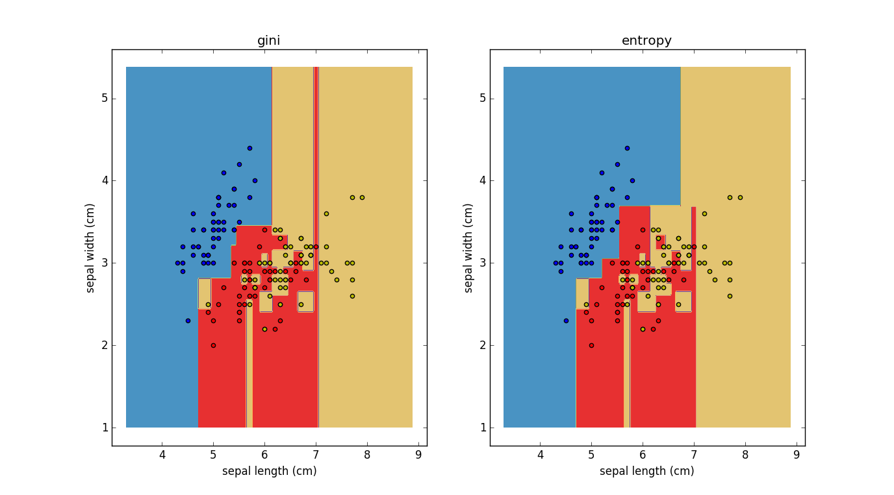
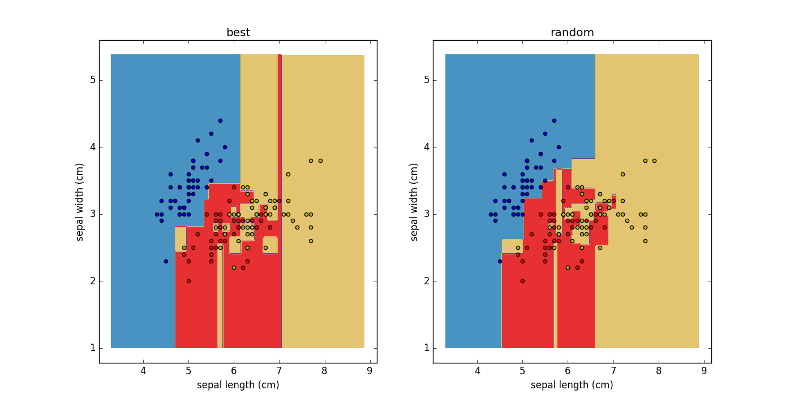
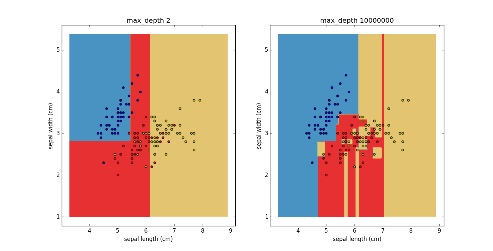
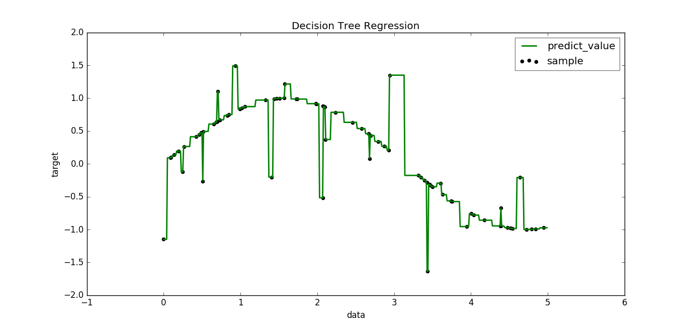
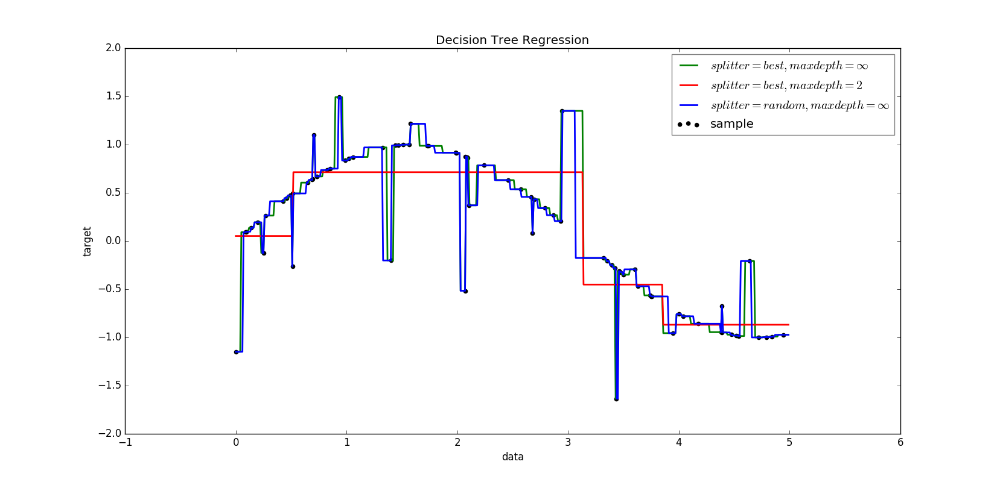
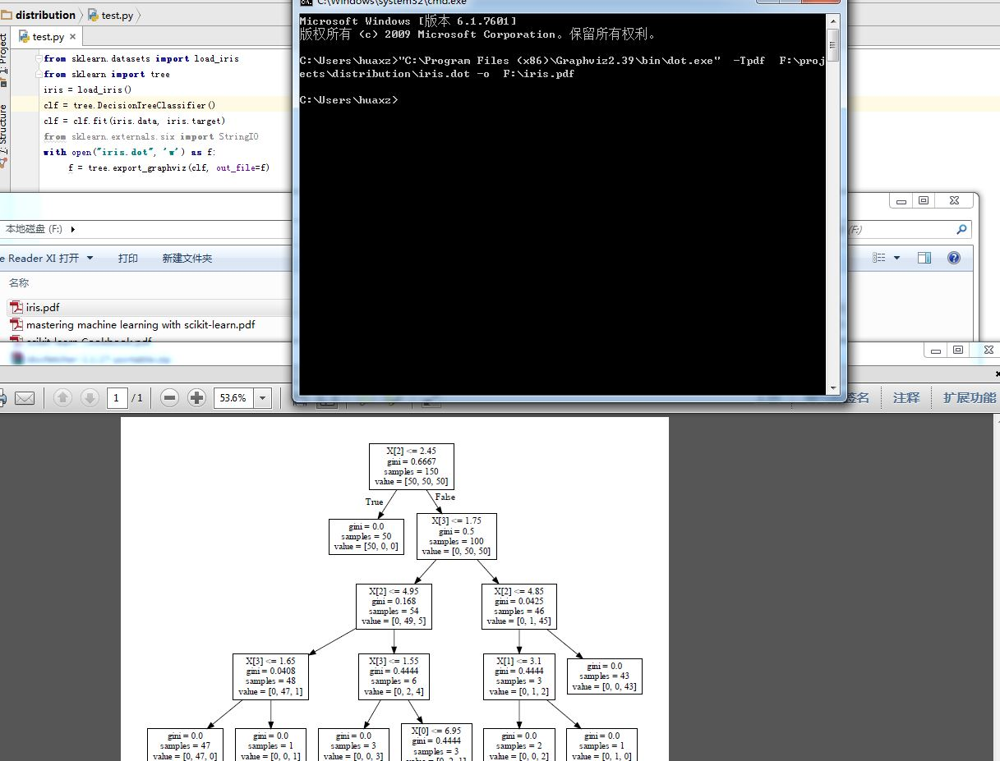

# 决策树

1.决策树是一种基本的分类与回归方法。本章讨论用于分类。

- 决策树模型呈树型结构，表示基于特征对实例进行分类的过程
- 它可以认为是`if-then`规则的集合；也可以认为是定义在特征空间与类空间上的条件概率分布
- 优点：可读性强，分类速度快
- 通常利用损失函数最小化原则建立决策树模型

2.决策树学习通常包括3个步骤：

- 特征选择
- 决策树生成
- 决策树剪枝

3.决策树定义：决策树模型是描述对实例进行分类的树形结构。树由结点和有向边组成。内部结点表示一个特征或者属性；叶子结点表示一个分类。

- 用决策树分类：对实例的某个特征进行测试，根据测试结果将实例分配到树的子结点上；此时每个子结点对应该特征的一个取值。递归地对实例测试直到叶结点，最后将实例分配到叶结点的类中。

4.决策树的路径是互斥并且是完备的。

5.决策树还表示给定特征条件下类的条件概率分布：

将特征空间划分为互不相交的单元，在每个单元定义一个类的概率分布就构成了一个条件概率分布。
> 即设某个单元 \\(S\\)  内部有 \\( N_s\\) 个样本点，则它定义了一个条件概率分布 \\(P(y=c_k/X),X \in S\\)

- 决策树的一条路径对应于划分中的一个基本单元。决策树所代表的条件概率分布由各个单元给定条件下类的条件概率分布组成。
- 叶结点（单元）上的条件概率偏向哪个类，则属于该类的概率较大。
	> 即在单元 \\(S\\)  内部有 \\( N_s\\) 个样本点，但是整个单元都属于类：\\(\hat c_k\\)，其中， \\(\hat c_k=\arg_{c_k} \max P(y=c_k/X),X \in S\\)。即单元 \\(S\\)  内部的\\( N_s\\) 个样本点，哪个分类占优，则整个单元都属于该类

6.**决策树的学习**：假设给定训练集 \\(T=\\{(\mathbf x_1,y_1),(\mathbf x_2,y_2),\cdots,(\mathbf x_N,y_N)\\}\\)，其中 \\(\mathbf x_i=(\mathbf x_i^{(1)},\mathbf x_i^{(2)},\cdots,\mathbf x_i^{(n)})\\) 为输入实例， n 为特征个数； \\(y_i \in \\{1,2,\cdots,K\\}\\) 为类标记， \\(i=1,2,\cdots,N\\),N 为样本容量

- 学习的目标：根据给定的训练数据集构造一个决策树模型，使得它能够对实例进行正确的分类
- 能对训练数据进行正确分类的决策树可能有多个，也可能一个也没有。
- 我们需要一个与训练数据矛盾较小的决策树，但是最重要的是：要有很好的泛化能力
- 决策树学习用损失函数来度量。其损失函数通常是正则化的极大似然函数。决策树学习的策略是以损失函数为目标函数的最小化
- 在损失函数意义下选择最优决策树的问题是个 NP 完全问题。现实中一般采用启发式方法近似求解这个最优化问题。这时的解为次最优的。
- 决策树学习的算法通常是一个递归地选择最优特征，并根据该特征对训练数据进行分割，使得对各个子数据集有一个最好的分类的过程。
	> 这一过程对应着特征空间的划分，也对应着决策树的构建

	步骤为：
	- 构建根节点，将所有训练数据放在根节点
	- 选择一个最优特征，根据这个特征将训练数据分割成子集，使得各个子集有一个在当前条件下最好的分类
		- 若这些子集已能够被基本正确分类，则构建叶结点，并将这些自己划分到对应的叶结点去
		- 若某个子集不能够被基本正确分类，则对该子集选择新的最优的特征，继续对该子集进行分割，构建相应的结点
	- 如此递归下去，直至所有训练数据子集都被基本正确分类，或者没有合适的特征为止。
	> 是否基本正确分类，通过后面介绍的指标来判断
- 上述生成的决策树可能对训练数据有很好的分类能力，但是对于未知的测试数据却未必有很好要的分类能力，即可能发生过拟合的现象。因此通常需要对已生成的树自下而上进行剪枝，从而使得决策树具有更好的泛化能力。
	- 剪枝：去掉过于细分的叶结点，使得该结点中的子集回退到父结点或更高层次的结点并让其成为叶结点

7.决策树的生成对应着模型的局部选择（选择哪一个特征）；决策树的剪枝则考虑全局最优（损失函数最小化）

8.特征选取：关键是选取对训练数据有较强分类能力的特征。

- 若一个特征的分类结果与随机分类的结果没有什么差别，则称这个特征是没有分类能力的
- 通常特征选取准则是：信息增益或者信息增益比。
> 若一个特征有更好的分类能力，则应该选择这个特征进行分类。分类能力通过信息增益或者信息增益比来体现

9.熵：表示随机变量不确定性的度量。设 \\(X\\) 是一个取有限个值的离散随机变量，其概率分布为：

\\(P(X=\mathbf x_i)=p_i,i=1,2,\cdots,n\\) , 则称随机变量 \\(X\\) 的熵定义为：
$$H(X)=-\sum_{i=1}^{n}p_i\log p_i$$
其中定义 \\(0\log 0=0\\)

- 对数可以用 2 为底或者以 e  为底。此时的熵分别称为比特和纳特
- 由定义可知，熵只依赖于 \\(X\\) 的分布，而与 \\(X\\) 的取值无关。它是概率分布函数的泛函，因此也将 \\(X\\) 的熵记作 \\(H(P)\\)
- 熵越大，则随机变量的不确定性越大。由定义可知 \\(0 \le H(P) \le  \log n\\)
- 当随机变量 \\(X\\) 只取两个值时， \\(X\\) 的分布为：
	$$P(X=1)=p \\\P(X=0)=1-p, 0 \le p \le 1$$
	此时熵为： \\(H(P)=-p \log p -(1-p) \log (1-p), 0 \le p \le 1\\)
	- 当 p=0 或者 p=1 时，随机变量完全没有不确定性，此时熵最小（为0）
	- 当  p=0.5 时，随机变量不确定性最大。此时熵为 \\(H(P)=1\\) 最大

  

10.设随机变量 \\((X,Y)\\) ，其联合概率分布为：\\(P(X=\mathbf x_i,Y=y_j)=p_{ij},i=1,2,\cdots,n;j=1,2,\cdots,m\\) 。 则条件熵 \\(H(Y/X)\\) 表示已知随机变量 \\(X\\) 的条件下随机变量 \\(Y\\) 的不确定性。

\\(H(Y/X)\\) 定义为： \\(X\\)给定条件下 \\(Y\\) 的条件概率分布的熵，对 \\(X\\) 概率分布的期望：
$$H(Y/X)=\sum_{i=1}^{n}P_X(X=\mathbf x_i)H(Y/X=\mathbf x_i)$$

- 当熵中的概率由数据估计得到时，称之为经验熵
- 当条件熵中的概率由数据估计得到时，称之为经验条件熵
> 其算法见后面的描述

11.特征 A  对训练数据集 T 的信息增益 \\(g(T,A)\\) 定义为集合 T 的经验熵 \\(H(T)\\) 与特征 A 给定条件下 T 的经验熵 \\(H(T/A)\\) 之差。即： \\(g(T,A)=H(T)-H(T/A)\\)

- 由于熵 \\(H(Y)-H(Y/X)\\) 也称作互信息，因此信息增益也等于训练数据集中类与特征的互信息
> 集合 T 的经验熵其实就是 T 中样本的分类 \\(Y\\) 的经验熵，即\\(H(Y)\\)。写成\\(H(T)\\) 是为了便于理解信息增益。

12.决策树学习应用信息增益准则选择特征。给定训练集 T 和特征 A：

- 经验熵 \\(H(T)\\) 表示对数据集 T 进行分类的不确定性
- 经验条件熵 \\(H(T/A)\\) 表示在特征 A 给定条件下对数据集 T 分类的不确定性
- \\(H(T)-H(T/A)\\)即信息增益就表示由于特征 A 而使得对数据集 D 的分类的不确定性减少的程度。
> 不同的特征往往具有不同的信息增益。信息增益大的特征具有更强的分类能力 

13.**信息增益算法**：假设训练数据集为 T ， |T| 为其样本容量。假设有 K 个类别依次为 \\(c_k,k=1,2,\cdots,K\\)。设 \\(|C_k|\\) 为属于类 \\(c_k\\) 的样本个数，则有：\\(\sum_{k=1}^{K}|C_k|=|T|\\)

设特征 A 有个 n 个不同的取值：\\(\\{a_1,a_2,\cdots,a_n\\}\\) ，根据特征 A 的取值将 T 划分出 n  个子集：\\( T_1,T_2,\cdots,T_n\\)，\\(|T_i|\\) 为对应的 \\(T_i\\)中的样本个数，则 \\(\sum_{i=1}^{n}|T_i|=|T|\\)

设集合 \\(T_i\\) 中属于类 \\(c_k\\) 的样本集合为： \\(T_{ik}\\),其样本个数为：\\(|T\_{ik}|\\)

- **输入**：训练数据集  T 和特征 A 
- **输出**: 特征 A 对于训练数据集 T 的信息增益 \\(g(T,A)\\)
- 算法：
	- 计算数据集 \\(T\\) 的经验熵 \\(H(T)\\)
	$$H(T)=-\sum_{k=1}^{K}\frac{|C_k|}{|T|}\log \frac{|C_k|}{|T|}$$
		> 它就是训练数据集 T 中，分类 \\(Y\\) 的概率估计\\(\hat P(Y=c_k)=\frac{|C_k|}{|T|}\\) 计算得到的经验熵。
	- 计算特征 A 对于数据集 T 的经验条件熵 \\(H(T/A)\\)
	$$H(T/A)=\sum_{i=1}^{n}\frac{|T_i|}{|T|}\sum\_{k=1}^{K} -( \frac{|T\_{ik}|}{|T_i|}\log\frac{|T\_{ik}|}{|T_i|})$$
		> - 它使用了特征 A 的概率估计：\\(\hat P(X^{(A)}=a_i)=\frac{|T_i|}{|T|}\\)
		> - 它使用了经验条件熵：\\(\hat H(T/X^{(A)}=a_i)=\sum\_{k=1}^{K} -( \frac{|T\_{ik}|}{|T_i|}\log\frac{|T\_{ik}|}{|T_i|})\\)，其中使用了条件概率估计 \\(\hat P(Y=c_k/X^{(A)}=a_i)=\frac{|T\_{ik}|}{|T_i|}\\)(意义是：在训练集的子集 \\(T_i\\)中， Y 的分布）
	- 计算信息增益： \\(g(T,A)=H(T)-H(T/A)\\)
	> 熵越大，则表示越混乱；熵越小表示越有序。因此信息增益表示混乱的减少程度（或者说是有序的增加程度）

14.以信息增益作为划分训练集的特征选取方案，存在偏向于选取值较多的特征的问题。公式：

$$g(T,A)=H(T)-H(T/A)=\sum_{i=1}^{n}\frac{|T_i|}{|T|}\sum\_{k=1}^{K} -( \frac{|T\_{ik}|}{|T_i|}\log\frac{|T\_{ik}|}{|T_i|})$$

当极限情况下A将每一个样本都分到一个节点当中去的时候（即每个节点中有且仅有一个样本），此时 \\(\frac{|T\_{ik}|}{|T_i|}=1, i=1,2,\cdots,n\\) 后面的括号部分为0.也就是条件熵部分为0，而条件熵的最小值为0，这意味着该情况下的信息增益达到了最大值。然而，我们知道这个特征A显然不是最佳选择。

可以通过定义信息增益比来解决。特征 A 对训练集 T 的信息增益比 \\(g_R(T,A)\\) 定义为信息增益 \\(g(T,A)\\) 与训练数据集 T 关于特征 A 的值的熵 \\(H_A(T)\\) 之比：

$$g_R(T,A)=\frac{g(T,A)}{H_A(T)},H_A(D)=-\sum_{i=1}^{n}\frac{|T_i|}{|T|}\log\frac{|T_i|}{|T|}$$
> \\(H_A(T)\\) 表征了特征 A 对训练集 T 的分辨能力（但不表征它对 分类\\(Y)\\的分辨能力，比如 A 将 T 切分成均匀的 num 块，但是这些块上可能 Y 都是相同的）

15.ID3 生成算法：核心是在决策树的每个结点上应用信息增益准则选择特征，递归地构建决策树。

从根结点开始，计算结点所有可能的特征的信息增益，选择信息增益最大的特征作为结点的特征，由该特征划分出子结点（<font color='red'>局部最优</font>)。

再对子结点递归地调用以上方法，构建决策树。直到所有特征的信息增益均很小或者没有特征可以选择为止。最后得到一个决策树
>如果不设置特征信息增益的下限，则可能会使得每个叶子都只有一个样本点，从而划分太细

ID3相当于用极大似然法进行概率模型的选择。

- 输入：训练数据集 T ，特征集 A ， 特征信息增益阈值 \\(\varepsilon \gt 0\\)
- 输出： 决策树 Tree
- 算法步骤：
	- 若 T 中所有实例均属于同一类 \\(c_k\\)，则 Tree 为单结点树，并将 \\(c_k\\) 作为该结点的类标记，返回 Tree
		> 特殊情况： T 的分类集合只有一个分类
	- 若 \\(A=\phi\\)，则 Tree 为单结点树，将 T 中实例数最大的类 \\(c_k\\) 作为该结点的类标记，返回 Tree（即多数表决）
		> 特殊情况： T 的特征集合为空
	- 否则计算 \\( g(D,A_i)\\)，其中 \\(A_i\\) 为特征集合中的各个特征，选择信息增益最大的特征 \\(A_g\\)
	- 判断 \\(A_g\\) 的信息增益：
		- 若  \\(g(D,A_g) \lt \varepsilon\\) ，则置 Tree 为单结点树，将 T 中实例数最大的类 \\(c_k\\) 作为该结点的类标记，返回 Tree
		- 若 \\(g(D,A_g) \ge \varepsilon\\) ，则对  \\(A_g\\) 特征的每个可能取值 \\(a_i\\) ,根据 \\(A_g=a_i\\) 将 T 划分为若干个非空子集 \\(T_i\\) ，将  \\(T_i\\) 中实例数最大的类作为标记，构建子结点，由子结点及其子结点构成树 Tree ， 返回 Tree
	- 对第  i 个子结点， 以 \\(T_i\\) 为训练集， 以 \\(A-\\{A_g\\}\\) 为特征集，递归地调用前面的步骤，得到子树  \\(Tree_i\\), 返回 \\(Tree_i\\)
		> 决策树上单条路径上的特征集逐渐缩小

> - 决策树可能只是用到特征集中的部分特征
> - ID3 算法只有树的生成算法。该算法生成的树容易产生过拟合。即对训练集匹配很好，但是预测测试集效果较差

15.C4.5 生活曾算法：与 ID3 算法相似，但是 C4.5 算法在生成过程中用信息增益比来选择特征。

- 输入：训练数据集 T ，特征集 A ， 特征信息增益比的阈值 \\(\varepsilon \gt 0\\)
- 输出： 决策树 Tree
- 算法步骤：
	- 若 T 中所有实例均属于同一类 \\(c_k\\)，则 Tree 为单结点树，并将 \\(c_k\\) 作为该结点的类标记，返回 Tree
		> 特殊情况： T 的分类集合只有一个分类
	- 若 \\(A=\phi\\)，则 Tree 为单结点树，将 T 中实例数最大的类 \\(c_k\\) 作为该结点的类标记，返回 Tree（即多数表决）
		> 特殊情况： T 的特征集合为空
	- 否则计算 \\( g_R(D,A_i)\\)，其中 \\(A_i\\) 为特征集合中的各个特征，选择信息增益比最大的特征 \\(A_g\\)
	- 判断 \\(A_g\\) 的信息增益比：
		- 若  \\(g_R(D,A_g) \lt \varepsilon\\) ，则置 Tree 为单结点树，将 T 中实例数最大的类 \\(c_k\\) 作为该结点的类标记（即多数表决），返回 Tree
		- 若 \\(g_R(D,A_g) \ge \varepsilon\\) ，则对  \\(A_g\\) 特征的每个可能取值 \\(a_i\\) ,根据 \\(A_g=a_i\\) 将 T 划分为若干个非空子集 \\(T_i\\) ，将  \\(T_i\\) 中实例数最大的类作为标记（即多数表决），构建子结点，由子结点及其子结点构成树 Tree ， 返回 Tree
	- 对第  i 个子结点， 以 \\(T_i\\) 为训练集， 以 \\(A-\\{A_g\\}\\) 为特征集，递归地调用前面的步骤，得到子树  \\(Tree_i\\), 返回 \\(Tree_i\\)
		> 决策树上单条路径上的特征集逐渐缩小

16.决策树的剪枝:

- 原因：决策树生成算法生成的树往往对于训练数据很准确，但是对于未知的测试数据分类却没有那么准确，即出现过拟合现象
	> 过拟合现象原因是决策树太复杂
		
	解决的办法是：对决策树剪枝，即对生成的决策树进行简化
- 剪枝过程：从已生成的树上裁掉一些子树或者叶结点，冰枪其根结点或者父节点作为新的叶结点
- 剪枝的目标：通过极小化决策树的整体损失函数或者代价函数来实现（<font color='red'>全局最优</font>)

	设树 \\(T\\) 的叶结点个数为 \\( |T\_{f}|\\) ，t 为树的叶结点，该叶结点有 \\(N_t\\) 个样本点，其中属于 \\(c_k\\) 类的样本点有 \\(N_{tk}, \quad k=1,2,\cdots,K\\) 个。则有： \\(\sum\_{k=1}^{K}N\_{tk}=N_t \\)

	令 \\(H(t)\\) 为叶结点 t 上的经验熵，令 \\(\alpha \ge 0\\)为参数，则决策树\\(T\\) 的损失函数定义为：
	$$C\_\alpha(T)=\sum\_{t=1}^{|T\_{f}|}N_tH(t)+\alpha|T\_{f}|\\\
	H(t)=-\sum\_{k=1}^{K}\frac{N\_{tk}}{N_t}\log\frac{N\_{tk}}{N_t}
	$$ 

	令:$$C(T)=\sum\_{t=1}^{|T\_{f}|}N_tH(t)=-\sum\_{t=1}^{|T\_{f}|}\sum\_{k=1}^{K}N\_{tk}\log\frac{N\_{tk}}{N_t}$$
	则： \\(C\_\alpha(T)=C(T)+\alpha|T\_{f}|\\)，其中 \\(\alpha|T\_{f}|\\) 为正则化项，\\(C(T)\\) 表示预测误差。
	>\\(C(T)=0\\) 意味着 \\(N_{tk}=N_t\\) ，即每个结点 t 内的样本都是纯的（即单一的分类，而不是杂的）

> 树 T 的叶子节点一定是样本训练集的一个划分。划分得越细致，则 T 的叶子节点越多； \\( |T\_{f}|\\) 小于等于样本集的数量，当取等号时，树 T 的每个叶子节点只有一个样本点。

- 参数  \\(\alpha\\) 控制预测误差与模型复杂度之间的关系。
	- 较大的 \\(\alpha\\) 会选择较简单的模型	
	- 较小的 \\(\alpha\\) 会选择较复制的模型
	- \\(\alpha = 0\\) 只考虑训练数据与模型的拟合程度，不考虑模型复杂度
- 剪枝考虑当 \\(\alpha\\) 确定时，选择 \\(C_\alpha(T)\\) 最小的模型
	> 决策树生成算法是学习局部的模型，决策树剪枝是学习整体的模型
- \\(C_\alpha(T)\\) 最小化等价于正则化的极大似然估计准则

17.树的剪枝算法：

- 输入： 生成算法产生的整棵树 T ，参数 \\(\alpha\\)
- 输出： 修剪后的树 \\(T_\alpha\\)
- 算法步骤：
	- 计算每个结点的经验熵
	- 递归地从树的叶结点向上回退：

		设一组叶结点回退到父节点之前与之后的整棵树分别为 \\(T_t\\) 与 \\(T_t^{\prime}\\)，对应的损失函数值分别为 \\(C\_\alpha(T_t)\\) 与\\(C\_\alpha(T_t^{\prime})\\)，若 \\(C\_\alpha(T_t)^{\prime} \le C_\alpha(T_t)\\)， 则进行剪枝，将父节点变成新的叶结点
	- 递归进行上一步，直到不能继续为止，得到损失函数最小的子树 \\(T_\alpha\\)

18.分类与回归树模型 (CART,classfification and regression tree) 同样由特征选取、树的生成、剪枝组成。它既可用于分类，也可用于回归

- CART 是给定输入随机变量 X  条件下，输出随机变量 Y 的条件概率分布的学习方法
- CART 假设决策树是二叉树，内部结点特征的取值为 `Y` 与 `N` 。左侧分支取 `是`，右侧分支取  `否`。它递归地二分每个特征，将输入空间划分为有限个单元
- CART算法分两步：
	- 决策树生成：用训练数据生成决策树，尽可能大
	- 决策树剪枝：用验证数据对生成的决策树剪枝。基于损失函数最小化的标准

19.CART生成：对回归树用平方误差最小化准则；对分类树采用基尼指数最小化准则

20.CART回归树的生成：

设输入 X，输出 Y，且 Y 是连续变量。给定训练数据集 \\(D=\\{(\mathbf x_1,y_1),(\mathbf x_2,y_2),\cdots,(\mathbf x_N,y_N)\\}\\)。一颗回归树对应着输入空间的一个划分以及在划分单元上的输出值。

设已经将输入空间划分为 M 个单元 \\(R_1,R_2,\cdots,R_M\\)，且在每个单元 \\(R_m\\) 上有一个固定的输出值 \\(c_m\\)，则回归树模型可以表示为：$$f(\mathbf x)=\sum_{m=1}^{M}c_m I(\mathbf x \in R_m)$$

- 如果给定输入空间的一个划分，回归树在训练数据集上的误差为（平方误差）：$$\sum_{\mathbf x_i \in R_m}(y_i-f(\mathbf x_i))^{2}$$

	基于平方误差最小的准则，可以求解出每个单元上的最优输出值 \\(\widehat{c_m}\\) 为 \\(R_m\\) 上所有输入实例 \\(\mathbf x_i\\) 对应的输出 \\(y_i\\) 的平均值。即：\\(\widehat{c_m}=\text{ave} (y_i\mid\mathbf x_i \in R_m)\\)

- 问题是：怎样对输入空间进行划分？ 
	- 设 \\(\mathbf x_i=(\mathbf x_i^{(1)},\mathbf x_i^{(2)},\cdots,\mathbf x_i^{(k)})\\)，即输入为 k 维。选择第 j 维 \\(\mathbf x_i^{(j)},\\) 和它的取值 s 作为切分变量和切分点。定义两个区域：$$R_1(j,s)=\\{\mathbf x \mid \mathbf x^{(j)} \le s\\},R_2(j,s)=\\{\mathbf x \mid \mathbf x^{(j)} \gt s\\}$$
	然后寻求最优切分变量 j 和最优切分点 s 。即求解：
$$\min_{j,s}[ \min\_{c\_1} \sum\_{\mathbf x\_i \in R\_1(j,s)}(y\_i-c\_1)^{2} +\min\_{c\_2} \sum\_{\mathbf x\_i \in R\_2(j,s)}(y\_i-c\_2)^{2}]$$

	  对于给定的维度 j  可以找到最优切分点 s 。同时：\\(\widehat{c_1}=\text{ave} (y_i \mid \mathbf x_i \in R_1(j,s)),\widehat{c_2}=\text{ave} (y_i \mid \mathbf x_i \in R_2(j,s))\\)
	 
	 - 问题是如何求解 j ?

		对所有的输入变量，变量所有的维度，找到最优切分维度 j，对该维度找到最优切分点 s 构成一个 (j,s) 对。
- 依次将输入空间划分为两个区域，然后重复对该区域划分过程，直到满足停止条件为止。这样的回归树称为最小二乘回归树。

21.最小二乘回归树生成算法：

- 输入： 训练数据集 D，停止计算条件
- 输出：  CART回归树 \\(f(x)\\)

在 D 所在的输入空间中，递归地将每个区域分为两个子区间并决定每个子区域上的输出值，构建二叉决策树。

- 步骤：
	- 选择最优切分维度 j 和切分点 s。即求解：$$\min_{j,s}[ \min\_{c\_1} \sum\_{\mathbf x\_i \in R\_1(j,s)}(y\_i-c\_1)^{2} +\min\_{c\_2} \sum\_{\mathbf x\_i \in R\_2(j,s)}(y\_i-c\_2)^{2}]$$
		- 求解方法：遍历维度 j；对固定的 j 扫描它所有可能的切分点 s。找到使得上式子最小的 (j,s) 对。
	- 用选定的 (j,s) 划分区域并决定响应的输出值：
	$$R_1(j,s)=\\{\mathbf x \mid \mathbf x^{(j)} \le s\\},R_2(j,s)=\\{\mathbf x \mid \mathbf x^{(j)} \gt s\\}\\\
	\widehat{c_1}=\text{ave} (y_i \mid \mathbf x_i \in R_1(j,s)),\widehat{c_2}=\text{ave} (y_i \mid \mathbf x_i \in R_2(j,s))$$
	- 对子区域 \\(R_1,R_2\\) 递归地调用上面两步，直到满足停止条件
	- 将输入空间划分为 M 个区域 \\(R_1,R_2,\cdots,R_M\\)，生成决策树：$$f(\mathbf x)=\sum_{m=1}^{M}\widehat{c_m} I(\mathbf x \in R_m)$$

22.CART分类树的生成：CART 分类树采用基尼指数选择最优特征，同时决定该特征的最优二值切分点。

- 基尼指数：假设有 K 个分类。样本点属于第 k 类的概率为 \\(p_k=P(Y=c_k)\\)，则概率分布的基尼指数为：
	$$Gini(p)=\sum\_{k=1}^{K}p_k(1-p_k)=1-\sum_{k=1}^{K}p_k^{2}$$
- 对于给定的样本集合 D，设属于类 \\(c_k\\) 的样本子集为 \\(C_k\\)，则基尼指数为：
	$$Gini(D)=1-\sum_{k=1}^{K}(\frac{|C_k|}{|D|})^{2}$$
- 若样本集D 根据特征  A 是否取某一个可能值 a 而被分为两个子集: \\(D_1\\) 和 \\(D_2\\)，其中：
	$$D_1=\\{(\mathbf x,y) \in D \mid \mathbf x^{(A)} =a\\},D_2=\\{(\mathbf x,y) \in D \mid \mathbf x^{(A)} \ne a\\}=D-D_1$$
	则在特征 A 的条件下，集合D的基尼指数为：$$Gini(D,A)=\frac{|D_1|}{|D|}Gini(D_1)+\frac{|D_2|}{|D|}Gini(D_2)$$

23.对于最简单的二项分布，设 \\(P(X=1)=p,P(X=0)=1-p\\)，则其基尼系数与熵的图形见下图。可以看到基尼系数与熵一样，也是度量不确定性的度量。

对于样本集 D， Gini(D) 越小，说明样本越属于同一类。

  

24.CART 分类树的生成算法：

- 输入： 训练数据集 D，停止计算条件
- 输出： CART决策树
- 步骤：
	根据 D ，从根节点开始，递归地对每个结点执行下列操作：
	- 计算现有特征对数据集 D 的基尼指数。此时对每个特征 A ，取它可能的每个值 a ,根据 A=a 将 D 分割成 \\(D_1\\) 与 \\(D_2\\)，计算 \\(Gini(D,A)\\)
	- 在所有可能的特征 A 以及所有他们可能的切分点 a 中，选取基尼指数最小的 A 以及 a 作为最优特征和最优切分点。现在从原结点生成了两个子结点，将训练集 D 按照特征分配到两个子结点中去
	- 对两个子结点递归调用上面两步，直到满足停止条件
	- 最终生成CART决策树

> 通常的停止条件为：
>
>- 结点中样本个数小于预定值
>- 样本集的基尼指数小于预定值
>- 没有更多的特征

25.CART剪枝：从完全生长的决策树底端减去一些子树，使得决策树变小（即模型变简单），从而使得它对未知数据有更好的预测能力

- CART剪枝由两步组成：
	- 从生成算法产生的决策树 \\(T_0\\)  底端开始不断的剪枝，直到 \\(T_0\\) 的根节点，形成一个子树序列 \\(\\{T_0,T_1,\cdots,T_n\\}\\)
	- 用交叉验证的方法在独立的验证集上对子树序列进行测试，挑选中出最优子树

26.CART剪枝过程：计算子树的损失函数为：\\(C\_\alpha(T)=C(T)+\alpha|T|\\)，其中 \\(C(T)\\) 为子树对训练数据的观测误差，\\(|T|\\) 为子树的叶结点个数。\\(\alpha \ge 0; C_\alpha(T)\\) 为参数是 \\(\alpha\\) 时子树 \\(T\\) 的整体损失

- 对固定的 \\(\alpha\\) ，存在使 \\(C\_\alpha(T)\\) 最小的子树。令其为 \\(T\_\alpha\\)， 可以证明 \\(T\_\alpha\\) 是唯一的。
	- 当 \\(\alpha\\) 大时，\\(T\_\alpha\\) 偏小
	- 当 \\(\alpha\\) 小时，\\(T\_\alpha\\) 偏大
	- 当 \\(\alpha=0\\) 时， 生成树就是最优的
	- 当 \\(\alpha=\infty\\) 时， 根组成的一个单结点树就是最优的

- 可以证明：可以用递归的方法对树进行剪枝。

	具体描述为：将 \\(\alpha\\)  从小增大，\\(0=\alpha_0 \lt \alpha_1\lt\cdots\lt \alpha_n \lt \infty\\)，产生一系列的区间 \\([\alpha_i,\alpha_i+1),i=0,1,\cdots,n\\) .剪枝得到的子树序列对应区间 \\(\alpha \in [\alpha_i,\alpha_i+1),i=0,1,\cdots,n\\) 时的最优子树序列 \\(\\{T_0,T_1,\cdots,T_n\\}\\)，其中序列 \\(\\{T_0,T_1,\cdots,T_n\\}\\) 是嵌套的

- 令从生成树 \\(T_0\\) 开始剪枝。对  \\(T_0\\)  内任意结点 t ，以  t 为单结点树的损失函数为：\\(C\_\alpha(t)=C(t)+\alpha\\)， 以 t 为根的子树\\(T_t\\) 的损失函数为： \\(C\_\alpha(T_t)=C(T_t)+\alpha|T_t|\\) ，可以证明：
	- 当 \\(\alpha=0\\) 及充分小时，有 \\(C\_\alpha(T_t) \lt C\_\alpha(t)\\)
	- 当 \\(\alpha\\) 增大到某个值时，有 \\(C\_\alpha(T_t) = C\_\alpha(t)\\)
	- 当 \\(\alpha\\) 再增大时，有 \\(C\_\alpha(T_t) \gt C\_\alpha(t)\\)

	因此令 \\(\alpha=\frac{C(t)-C(T_t)}{|T_t|-1}\\),此时 \\(T_t\\) 与 t 有相同的损失函数值，但是 t 的结点更少，因此 t  比 \\(T_t\\) 更可取，于是对   \\(T_t\\) 进行剪枝成一棵单结点树。

	因此对 \\(T_0\\) 内部的每一个结点 t ，计算 \\(g(t)=\frac{C(t)-C(T_t)}{|T_t|-1}\\)，它表示剪枝后整体损失函数减少的程度。在 \\(T_0\\) 内减去 \\(g(t)\\) 最小的子树 \\(T_t\\)，得到的子树作为  \\(T_1\\),同时将最小的 \\(g(t)\\) 作为 \\(\alpha_1\\),则 \\(T_1\\) 为 \\(\alpha\\) 在区间 \\(\[\alpha_1,\alpha_2)\\) 内的最优子树
	如此剪枝下去，直到根节点。此过程中不断增加  \\(\alpha\\)  的值，产生新区间

27.CART剪枝交叉验证过程：用独立的验证数据集来测试子树序列 \\(\\{T_0,T_1,\cdots,T_n\\}\\) 中各子树的平方误差或者基尼指数。平方误差或者基尼指数最小的决策树被认为是最优的决策树。
> 由于 \\(\\{T_1,\cdots,T_n\\}\\) 对应于一个参数序列 \\(\\{\alpha_1,\alpha_2,\cdots,\alpha_n\\}\\)，因此当最优子树 \\(T_k\\) 确定时，对应的 \\(\alpha_k\\) 也确定了。

28.CART剪枝算法：

- 输入： CART算法生成的决策树 T_0
- 输出： 最优决策树 \\(T_\alpha\\)
- 算法步骤：
	- 令 \\(k=0,T=T_0\\)
	- 令 \\(\alpha=\infty\\)
	- 自下而上的对各内部结点 t 计算 \\(C(T_t)，|T_t|,g(t)=\frac{C(t)-C(T_t)}{|T_t|-1},\alpha=\min(\alpha,g(t))\\) ,
	- 自下而上地访问内部结点 t， 若有\\(g(t)=\alpha\\) ,则进行剪枝，并对叶结点 t 以多数表决法决定其分类，得到树 T
	- 令 k=k+1,\\(\alpha_k=\alpha,T_k=T\\)
	- 若 T 不是由根结点单独构成的树，则继续前面的步骤
	- 采用交叉验证法在子树序列 \\(T_0,T_1,\cdots,T_n\\) 中选取最优子树 \\T_\alpha\\)

## 实践

1.`scikit-learn` 中有两个决策树类，它们均采用优化的`CART决策树`算法：

- `sklearn.tree.DecisionTreeRegressor`：回归决策树
- `sklearn.tree.DecisionTreeClassifier`：分类决策树

2.`DecisionTreeClassifier`:分类树

它的初始化函数为：

```
sklearn.tree.DecisionTreeClassifier(criterion='gini', splitter='best', max_depth=None,
min_samples_split=2, min_samples_leaf=1, min_weight_fraction_leaf=0.0, 
max_features=None,random_state=None, max_leaf_nodes=None, class_weight=None,
presort=False)
```

参数为：

- `criterion`：一个字符串，指定切分质量的评价准则。默认为`'gini'`。你可以选择`'gini'` 或者  `'entropy'`（熵）
- `splitter `：一个字符串，指定切分原则。默认为`'best'`，表示选择最优的切分。你也可以设为`'random'`，表示随机切分
- `max_features`：可以为整数、浮点、字符串或者`None`，指定了寻找`best split`时考虑的特征数量
	- 如果是整数，则每次切分只考虑 `max_features ` 个特征
	- 如果是浮点数，则每次切分只考虑  `max_features * n_features` 个特征（`max_features `指定了百分比）
	- 如果是字符串 `'auto'`或者`'sqrt'`，则 `max_features`等于 `sqrt(n_features)`
	- 如果是字符串`'log2'`，则 `max_features`等于 `log2(n_features)`
	- 如果是 `None`，则 `max_features`等于 `n_features`
	> 如果已经考虑了`max_features` 个特征，但是还没有找到一个有效的切分，那么还会继续寻找下一个特征，直到找到一个有效的切分为止

- `max_depth`：可以为整数或者`None`，指定树的最大深度
	- 如果为`None`，则表示树的深度不限（直到每个叶子都是纯的即叶结点中所有样本点都属于一个类，或者叶子中包含小于 `min_samples_split` 个样点）
	- 如果 `max_leaf_nodes` 非 `None`，则忽略此选项
- `min_samples_split`：为整数，指定每个内部结点（非叶结点）包含的最少的样本数
- `min_samples_leaf`：为整数，指定每个叶结点包含的最少的样本数
- `min_weight_fraction_leaf`：为浮点数，叶结点中样本的最小权重系数
- `max_leaf_nodes`：为整数或者`None`，指定最大的叶结点数量。
	- 如果为`None`，此时叶结点数量不限
	- 如果非`None`，则`max_depth`被忽略
- `class_weight`：为一个字典、字典的列表、字符串`'balanced'`、或者 `None`，它指定了分类的权重。权重的形式为：`{class_label:weight}`。
	- 如果为`None`，则每个分类的权重都为1
	- 如果是`multi-output`问题，则`list of dicts`会按照`columns of y`的相同的顺序提供
	- 字符串`'balanced'` 表示分类的权重是样本中，各分类出现的频率的反比
	> 注意如果 `sample_weight`提供了（由 `fit`方法提供），则这些权重都会乘以`sample_weight`
- `random_state`：指定 `RandomState`的初始化条件。
- `presort`：一个布尔值，指定是否要提前排序数据从而加速寻找最优切分的过程
	> 设置为 `True`，时，对于大数据集会减慢总体的训练过程；但是对于一个小数据集或者设定了最大深度的情况下，会加速训练过程

属性为：

- `classes_`：一个形状为`(n_classes,)`的数组，或者一个这种形状数组的列表
	- 对于单输出问题，为一个形状为`(n_classes,)`的数组，表示分类的标签
	- 对于多输出问题，为一个这种形状数组的列表，表示分类的标签
- `feature_importances_`：一个形状为：`(n_features,)`的数组，给出了特征的重要程度。该值越高，则该特征越重要。（也称为 `Gini importance`）
- `max_features_`：`max_features`的推断值
- `n_classes_`：整数或者列表。对于单输出问题，该值是分类的数量；对于多输出问题，该值是个每个输出中的分类的数量
- `n_features_`：当执行`fit`之后，特征的数量
- `n_outputs_`：当执行`fit`之后，输出的数量
- `tree_`：一个 `Tree`对象，即底层的决策树

3.决策分类树的例子：

```
import numpy as np
import matplotlib.pyplot as plt
from sklearn.datasets import load_iris
from sklearn.tree import DecisionTreeClassifier

# Parameters
n_classes = 3
plot_colors = "bry"
plot_step = 0.02

# 加载数据
iris = load_iris()
fig=plt.figure()
for pairidx, pair in enumerate([[0, 1], [2, 3]]):
    X = iris.data[:, pair] # 依次取两个特征 （0, 1）, （2, 3）
    y = iris.target
    # 训练数据
    clf = DecisionTreeClassifier().fit(X, y)

    # 绘制边界
    x_min, x_max = X[:, 0].min() - 1, X[:, 0].max() + 1
    y_min, y_max = X[:, 1].min() - 1, X[:, 1].max() + 1
    xx, yy = np.meshgrid(np.arange(x_min, x_max, plot_step),
	np.arange(y_min, y_max, plot_step))
    Z = clf.predict(np.c_[xx.ravel(), yy.ravel()])
    Z = Z.reshape(xx.shape)
    ax=fig.add_subplot(1, 2, pairidx + 1)
    ax.contourf(xx, yy, Z, cmap=plt.cm.Paired)

    ax.set_xlabel(iris.feature_names[pair[0]])
    ax.set_ylabel(iris.feature_names[pair[1]])

    # 绘制训练数据
    for i, color in zip(range(n_classes), plot_colors):
        idx = np.where(y == i)
        ax.scatter(X[idx, 0], X[idx, 1], c=color, label=iris.target_names[i],
	 cmap=plt.cm.Paired)

ax.legend(framealpha=0.5)
fig.suptitle("Decision surface of a decision tree using paired features")
plt.show()
```

  

若考虑不同的评价准则：（模型复杂度相同）
> 直观看模型复杂度：从正中间分界线开始，观测左边的蓝色区域右下角封闭曲线有几条折现，则树的深度就是多少

   

若考虑不同的切分：（随机切分的树深度较深，模型较复杂）
  

若考虑不同的最大深度：（树越深，模型越复杂，分界线越崎岖；树越浅，模型越简单，分界线越光滑）
  


4.`DecisionTreeRegressor`:回归树

它的初始化函数为：

```
sklearn.tree.DecisionTreeRegressor(criterion='mse', splitter='best', max_depth=None,
min_samples_split=2, min_samples_leaf=1, min_weight_fraction_leaf=0.0, 
max_features=None,random_state=None, max_leaf_nodes=None, presort=False)
```

参数为：

- `criterion`：一个字符串，指定切分质量的评价准则。默认为`'mse'`（只支持该字符串），表示均方误差。
- `splitter `：一个字符串，指定切分原则。默认为`'best'`，表示选择最优的切分。你也可以设为`'random'`，表示随机切分
- `max_features`：可以为整数、浮点、字符串或者`None`，指定了寻找`best split`时考虑的特征数量
	- 如果是整数，则每次切分只考虑 `max_features ` 个特征
	- 如果是浮点数，则每次切分只考虑  `max_features * n_features` 个特征（`max_features `指定了百分比）
	- 如果是字符串 `'auto'`或者`'sqrt'`，则 `max_features`等于 `n_features`
	- 如果是字符串`'log2'`，则 `max_features`等于 `log2(n_features)`
	- 如果是 `None`，则 `max_features`等于 `n_features`
	> 如果已经考虑了`max_features` 个特征，但是还没有找到一个有效的切分，那么还会继续寻找下一个特征，直到找到一个有效的切分为止

- `max_depth`：可以为整数或者`None`，指定树的最大深度
	- 如果为`None`，则表示树的深度不限（直到每个叶子都是纯的即叶结点中所有样本点都属于一个类，或者叶子中包含小于 `min_samples_split` 个样点）
	- 如果 `max_leaf_nodes` 非 `None`，则忽略此选项
- `min_samples_split`：为整数，指定每个内部结点（非叶结点）包含的最少的样本数
- `min_samples_leaf`：为整数，指定每个叶结点包含的最少的样本数
- `min_weight_fraction_leaf`：为浮点数，叶结点中样本的最小权重系数
- `max_leaf_nodes`：为整数或者`None`，指定最大的叶结点数量。
	- 如果为`None`，此时叶结点数量不限
	- 如果非`None`，则`max_depth`被忽略
- `class_weight`：为一个字典、字典的列表、字符串`'balanced'`、或者 `None`，它指定了分类的权重。权重的形式为：`{class_label:weight}`。
	- 如果为`None`，则每个分类的权重都为1
	- 如果是`multi-output`问题，则`list of dicts`会按照`columns of y`的相同的顺序提供
	- 字符串`'balanced'` 表示分类的权重是样本中，各分类出现的频率的反比
	> 注意如果 `sample_weight`提供了（由 `fit`方法提供），则这些权重都会乘以`sample_weight`
- `random_state`：指定 `RandomState`的初始化条件。
- `presort`：一个布尔值，指定是否要提前排序数据从而加速寻找最优切分的过程
	> 设置为 `True`，时，对于大数据集会减慢总体的训练过程；但是对于一个小数据集或者设定了最大深度的情况下，会加速训练过程

属性为：

- `feature_importances_`：一个形状为：`(n_features,)`的数组，给出了特征的重要程度。该值越高，则该特征越重要。（也称为 `Gini importance`）
- `max_features_`：`max_features`的推断值
- `n_features_`：当执行`fit`之后，特征的数量
- `n_outputs_`：当执行`fit`之后，输出的数量
- `tree_`：一个 `Tree`对象，即底层的决策树

5.决策回归树例子：

```
import numpy as np
from sklearn.tree import DecisionTreeRegressor
import matplotlib.pyplot as plt

# Create a random dataset
rng = np.random.RandomState(1)
X = np.sort(5 * rng.rand(80, 1), axis=0)
y = np.sin(X).ravel()
y[::5] += 3 * (0.5 - rng.rand(16))

# Fit regression model
regr_1 = DecisionTreeRegressor()
regr_1.fit(X, y)

# Predict
X_test = np.arange(0.0, 5.0, 0.01)[:, np.newaxis]
y_1 = regr_1.predict(X_test)

# Plot the results
fig=plt.figure()
ax=fig.add_subplot(1,1,1)
ax.scatter(X, y, c="k", label="sample")
ax.plot(X_test, y_1, c="g", label="predict_value", linewidth=2)
ax.set_xlabel("data")
ax.set_ylabel("target")
ax.set_title("Decision Tree Regression")
ax.legend(framealpha=0.5)
plt.show()
```

  

不同的参数：其中折线越多，模型越复杂。

  

6.当你训练完毕一颗决策树的时候，可以通过`sklearn.tree.export_graphviz(classifier,out_file)`来将决策树转化成`Graphviz`格式的文件，然后通过`Graphviz`的 `dot`工具，运行命令：

```
dot.exe -Tpdf iris.dot -o iris.pdf
```
来生成决策图。

  
